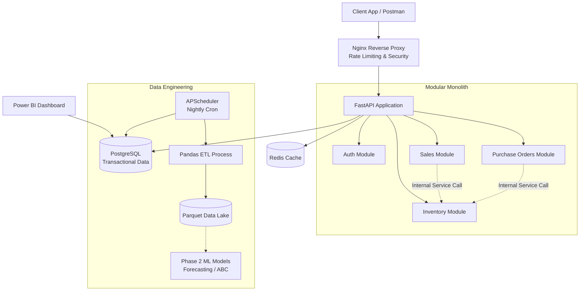
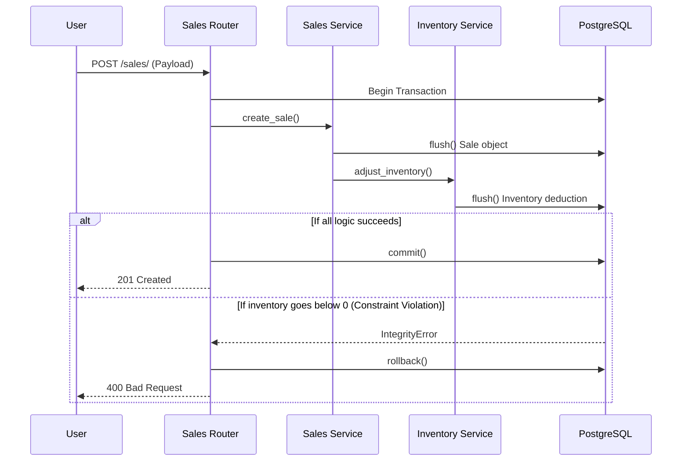

# OptiStock Enterprise 🚀


OptiStock Enterprise is a cloud-native, multi-tenant Inventory Intelligence and Supply Chain Management platform. It bridges the gap between operational backend engineering and data-driven business intelligence. 

It handles everything from strict ACID-compliant inventory deductions and Role-Based Access Control (RBAC), to automated ETL pipelines, Machine Learning scaffolding, and real-time Power BI data views.

---

## 📑 Table of Contents
- [Features](#-features)
- [Tech Stack](#-tech-stack)
- [Architecture & Diagrams](#-architecture--diagrams)
- [Database Schema & Analytics](#-database-schema--analytics)
- [Setup Instructions](#-setup-instructions)
- [API Documentation](#-api-documentation)
- [AWS Deployment](#-aws-deployment)
- [Production Readiness Checklist](#-production-readiness-checklist)

---

## 🌟 Features

- **Multi-Tenant Architecture**: Strict data isolation via `company_id`, ensuring enterprise compliance.
- **ACID-Compliant Transactions**: Bulletproof inventory mechanics preventing race conditions and ghost stock.
- **Automated Data Lake (ETL)**: A nightly job extracts completed sales into optimized Parquet files, persisted on a Docker volume.
- **Demand Forecasting**: Average daily velocity over a 30-day trailing window, extrapolated across a 7-day horizon and written back as explainable reorder recommendations — net of stock already on hand, so well-stocked products generate no noise. Every figure behind a suggestion is stored in its `evidence` payload.
- **ABC Inventory Analysis**: Nightly Pareto classification (A/B/C by revenue contribution), ranked *within* each tenant and written to `products.abc_class`.
- **Business Intelligence Ready**: Pre-aggregated SQL Views specifically optimized for Power BI dashboards.

- **Compliance Audit Trail**: Every create/update/delete on a tracked entity is recorded automatically by a SQLAlchemy flush listener — entity, action, before/after values, actor and tenant — in the same transaction as the change itself, so a rolled-back operation leaves no trace.
- **Enterprise Security**: JWT authentication with database-backed identity resolution (revoked or demoted users lose access on their next request), role-based access control, bcrypt hashing, per-account lockout and rate-limited login.

> **Not yet wired:** Economic Order Quantity and safety-stock helpers exist and are unit-tested in `app/modules/analytics/eoq.py` but nothing calls them yet. Redis caching is initialised but unused. The email interface in `app/core/notifications.py` is a mock with no callers, so none of the alerting requirements (FR-NF-*) are met. `AuditService.log_action` is superseded by the flush listener and is now itself unused.

> **Roles:** `platform_admin`, `admin`, `finance`, `supply_chain`, `warehouse_manager`, `sales_rep`, `analyst`. Note that `platform_admin` — required by every `/api/v1/companies` endpoint — is absent from the role list `POST /auth/register` accepts, so it can currently only be assigned directly in the database.
- **DevOps & Observability**: Dockerized stack, GitHub Actions CI/CD, Nginx rate-limiting, and Prometheus metrics.

---

## 🛠 Tech Stack

- **Backend Framework**: FastAPI (Python 3.12)
- **Database (Relational)**: PostgreSQL 15, SQLAlchemy 2.0 (ORM), Alembic (Migrations)
- **Database (Analytical)**: Apache Parquet (Data Lake)
- **Caching**: Redis 7
- **Security**: Nginx (Reverse Proxy), Passlib/Bcrypt, JWT
- **Infrastructure**: Terraform, AWS (VPC, EC2), Docker, Docker Compose
- **CI/CD**: GitHub Actions, Pytest
- **Monitoring**: Prometheus (`prometheus-fastapi-instrumentator`)

---

## 📐 Architecture & Diagrams

### 1. High-Level System Architecture
OptiStock uses a **Modular Monolith** architecture. Domains (Sales, Inventory, Purchasing) are strictly separated by directories but run in a single process, making database transactions safe and atomic.



### 2. Request Flow (Atomic Transactions)


### 3. Docker & AWS Deployment Architecture
```mermaid
graph LR
    subgraph AWS VPC (us-east-1)
        IGW[Internet Gateway] --> Subnet[Public Subnet]
        
        subgraph EC2 Instance (t3.medium)
            Docker[Docker Engine]
            
            Docker --> NginxContainer[Nginx Container\nPort 80]
            Docker --> APIContainer[FastAPI Container\nPort 8000]
            Docker --> DBContainer[PostgreSQL Container\nPort 5432]
            Docker --> RedisContainer[Redis Container\nPort 6379]
            
            NginxContainer --> APIContainer
            APIContainer --> DBContainer
            APIContainer --> RedisContainer
        end
    end
```

---

## 🗄 Database Schema & Analytics

OptiStock's database is designed for both high-speed transaction processing (OLTP) and downstream analytics (OLAP).

### Core Tables
- `companies`: The root of the multi-tenant architecture.
- `users`: Stores employee credentials and RBAC roles (`admin`, `warehouse_manager`, `sales_rep`).
- `products`: SKU catalog, financial pricing, and categorization.
- `inventory` & `warehouses`: Tracks current stock levels. `inventory` enforces a `>= 0` check constraint.
- `sales` & `sale_items`: Records outbound revenue.
- `purchase_orders` & `suppliers`: Records inbound restocks.

### Analytical SQL Views (For Power BI)
To prevent BI tools from crashing the live application with heavy `JOIN` and `GROUP BY` clauses, we maintain pre-aggregated views via Alembic migrations:
1. `current_stock_levels_view`: Real-time warehouse capacities and product stock levels.
2. `monthly_revenue_view`: Aggregated sales data grouped by month and product category.
3. `supplier_performance_view`: Evaluates supplier reliability based on fulfilled purchase orders.

---

## 🚀 Setup Instructions

### Prerequisites
- Python 3.12+
- Docker & Docker Compose
- PostgreSQL (If running outside of Docker)

### 1. Local Development Setup
```bash
# Clone the repository
git clone https://github.com/yourusername/optistock.git
cd optistock

# Create virtual environment
python -m venv venv
source venv/bin/activate  # On Windows: .\venv\Scripts\activate

# Install dependencies
pip install -r requirements.txt

# Setup Environment Variables
cp .env.example .env
# Edit .env and set your DATABASE_URL and SECRET_KEY

# Run Database Migrations
alembic upgrade head

# Start the Development Server
uvicorn app.main:app --reload
```

### 2. Docker Deployment
```bash
# Build and start the entire stack (Nginx, API, Postgres, Redis,
# plus the outbox relay and the event consumers)
docker compose up -d --build
```
The API will be available at `http://localhost/api/v1/`.

### 3. Background processes

Compose runs these for you. Outside Docker they are separate entrypoints, and
the event system does nothing without the first two:

```bash
python -m app.workers.relay       # event_outbox -> Redis Streams
python -m app.workers.consumers   # raises alerts, maintains projections
```

The daily-metrics projection is derived state and can always be recomputed from
the source tables. Run this after seeding — a year of seeded history predates
the event system and therefore emitted no events, so nothing else will put it
in the read model:

```bash
python -m app.workers.rebuild_projections          # all history
python -m app.workers.rebuild_projections --days 90
```

---

## 🔐 Environment Variables

Create a `.env` file in the root directory:

```env
DATABASE_URL=postgresql://optistock:optistock_password@db:5432/optistock_db
REDIS_URL=redis://redis:6379/0
SECRET_KEY=your_super_secret_key_change_in_production
ALGORITHM=HS256
ACCESS_TOKEN_EXPIRE_MINUTES=30
ALLOWED_ORIGINS=["http://localhost:3000", "https://yourfrontend.com"]
```

---

## 📖 API Documentation

FastAPI automatically generates interactive Swagger documentation.
Once the server is running, visit: **`http://localhost:8000/docs`**

### Important Endpoints

#### Authentication
- `POST /api/v1/auth/register`: Register a new user.
- `POST /api/v1/auth/login`: Authenticate and receive a JWT.

#### Products & Inventory
- `GET /api/v1/products/`: Paginated product catalog.
- `POST /api/v1/products/import-csv`: Bulk import products.
- `GET /api/v1/inventory/`: Real-time stock levels.

#### Transactions
- `POST /api/v1/sales/`: Create a sale (Atomically deducts inventory).
- `POST /api/v1/purchase_orders/`: Create a PO.

#### Observability
- `GET /ready`: Fast lightweight health check for AWS ALBs.
- `GET /health`: Deep database connectivity check.
- `GET /metrics`: Prometheus metrics for Grafana integration.

---

## ☁️ AWS Deployment (Terraform)

The infrastructure is defined as Code using Terraform in the `terraform/` directory. It provisions a VPC, public subnets, and an EC2 instance.

```bash
cd terraform
terraform init
terraform plan
terraform apply
```
*Continuous Deployment:* Pushing to the `main` branch triggers the GitHub Actions workflow (`.github/workflows/deploy.yml`), which runs `pytest`, SSHs into the EC2 instance, and rebuilds the Docker stack with zero downtime.

---

## ✅ Final Production Readiness Checklist

**Implemented & Hardened:**
- [x] ACID Compliant Transactions (Router-owned `commit`/`rollback`).
- [x] Multi-Tenant Database Isolation (`company_id`).
- [x] JWT Authentication & Role-Based Access Control.
- [x] Automated Testing (`pytest` with mocks).
- [x] Infrastructure as Code (AWS Terraform).
- [x] CI/CD Pipeline (GitHub Actions).
- [x] API Gateway / Reverse Proxy (Nginx with Rate Limiting).
- [x] Observability (Prometheus Metrics & JSON Logging).
- [x] BI Analytics (SQL Views for Power BI).

**Intentionally Deferred (Future Enhancements):**
- *Asynchronous Database Driver*: Currently using `psycopg2` (sync) for MVP stability with complex ORM logic. Future enhancement involves migrating to `asyncpg`.
- *AWS RDS Migration*: Currently running Postgres inside Docker on EC2. The architecture is completely modular; upgrading to AWS RDS requires only a `.env` database URL change.
- *Redis Caching*: Redis is provisioned but endpoint-level caching (`fastapi-cache2`) is deferred to prioritize transactional integrity during Phase 1. 

---
*Built with ❤️ for Enterprise Scale.*
