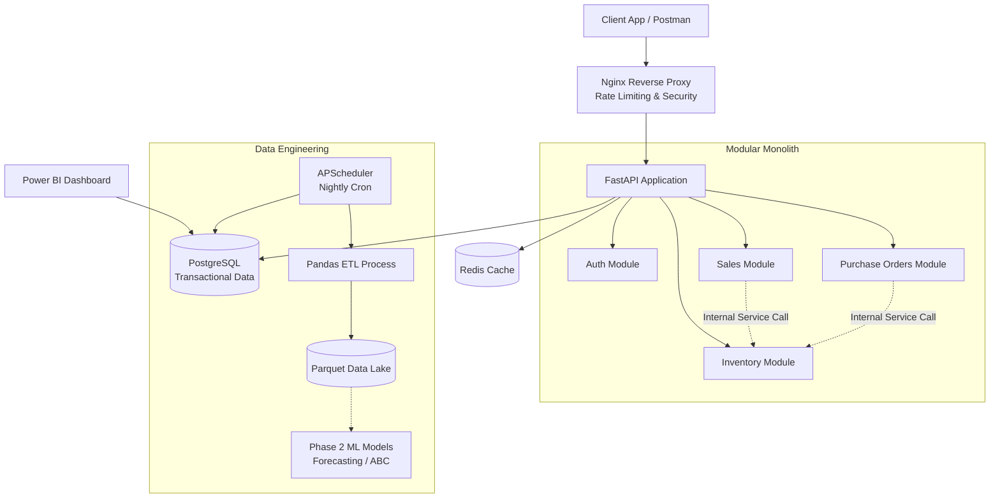
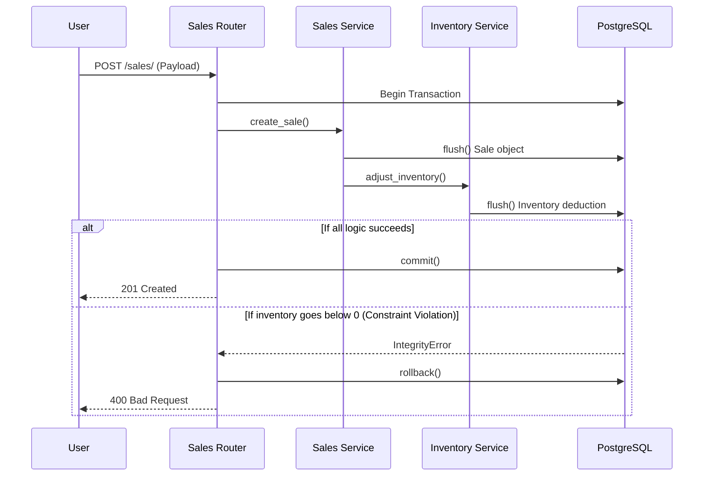

# OptiStock Enterprise 🚀


OptiStock Enterprise is a cloud-native, multi-tenant Inventory Intelligence and Supply Chain Management platform. It bridges the gap between operational backend engineering and data-driven business intelligence. 

It handles everything from strict ACID-compliant inventory deductions and Role-Based Access Control (RBAC), to automated ETL pipelines, Machine Learning scaffolding, and real-time Power BI data views.

---

## 📑 Table of Contents
- [Features](#-features)
- [Tech Stack](#-tech-stack)
- [Architecture & Diagrams](#-architecture--diagrams)
- [Database Schema & Analytics](#-database-schema--analytics)
- [Setup Instructions](#-setup-instructions)
- [API Documentation](#-api-documentation)
- [AWS Deployment](#-aws-deployment)
- [Production Readiness Checklist](#-production-readiness-checklist)

---

## 🌟 Features

- **Multi-Tenant Architecture**: Strict data isolation via `company_id`, ensuring enterprise compliance.
- **ACID-Compliant Transactions**: Bulletproof inventory mechanics preventing race conditions and ghost stock.
- **Automated Data Lake (ETL)**: A nightly job extracts completed sales into optimized Parquet files, persisted on a Docker volume.
- **Demand Forecasting**: Average daily velocity over a 30-day trailing window, extrapolated across a 7-day horizon and written back as explainable reorder recommendations — net of stock already on hand, so well-stocked products generate no noise. Every figure behind a suggestion is stored in its `evidence` payload.
- **Stockout Prediction**: Ranks every stock line by *days remaining* at its observed sales rate, not by whether it is under a threshold somebody typed in once. Two hundred units selling forty a day is an emergency; two hundred selling one a day is fine, and a static reorder point flags the second while missing the first. Each row carries the numbers behind its prediction — on hand, reorder point, daily usage, days left, projected date — plus a one-sentence explanation computed server-side, so the screen, the API and the assistant cannot disagree about what a row means.
- **AI Assistant with a hard safety boundary**: Tool calling against read-only functions (never text-to-SQL), with the tenant bound in a closure from the verified JWT and absent from every schema the model can see. In demo mode identifiers are replaced with stable pseudonyms before anything leaves the process and restored in the answer, so the provider sees hashes and the user reads real SKUs. Answers are validated before they render — an assistant that claims to have placed an order is flagged, because that claim is false in every configuration of this system.
- **Human-in-the-loop write actions**: The assistant can *propose* a purchase order; it cannot place one. Proposals land on an Approvals screen where a person accepts, amends or rejects them, and approving runs the same service and the same role check as creating a PO by hand. What the model asked for and what the human actually ran are stored in separate columns, so an amended quantity is a signal rather than an overwrite.
- **ABC Inventory Analysis**: Nightly Pareto classification (A/B/C by revenue contribution), ranked *within* each tenant and written to `products.abc_class`.
- **Business Intelligence Ready**: Pre-aggregated SQL Views specifically optimized for Power BI dashboards.

- **Compliance Audit Trail**: Every create/update/delete on a tracked entity is recorded automatically by a SQLAlchemy flush listener — entity, action, before/after values, actor and tenant — in the same transaction as the change itself, so a rolled-back operation leaves no trace.
- **Enterprise Security**: JWT authentication with database-backed identity resolution (revoked or demoted users lose access on their next request), role-based access control, bcrypt hashing, per-account lockout and rate-limited login.

> **Not yet wired:** Economic Order Quantity and safety-stock helpers exist and are unit-tested in `app/modules/analytics/eoq.py` but nothing calls them yet. Redis caching is initialised but unused. The email interface in `app/core/notifications.py` is a mock with no callers, so none of the alerting requirements (FR-NF-*) are met. `AuditService.log_action` is superseded by the flush listener for ordinary CRUD, and is now used only where the listener cannot help: recording an assistant proposal alongside the decision a human made about it.

> **Roles:** `platform_admin`, `admin`, `finance`, `supply_chain`, `warehouse_manager`, `sales_rep`, `analyst`. Note that `platform_admin` — required by every `/api/v1/companies` endpoint — is absent from the role list `POST /auth/register` accepts, so it can currently only be assigned directly in the database.
- **DevOps & Observability**: Dockerized stack, GitHub Actions CI/CD, Nginx rate-limiting, and Prometheus metrics.

---

## 🛠 Tech Stack

- **Backend Framework**: FastAPI (Python 3.12)
- **Database (Relational)**: PostgreSQL 15, SQLAlchemy 2.0 (ORM), Alembic (Migrations)
- **Database (Analytical)**: Apache Parquet (Data Lake)
- **Caching**: Redis 7
- **Security**: Nginx (Reverse Proxy), Passlib/Bcrypt, JWT
- **Infrastructure**: Terraform, AWS (VPC, EC2), Docker, Docker Compose
- **CI/CD**: GitHub Actions, Pytest
- **Monitoring**: Prometheus (`prometheus-fastapi-instrumentator`)

---

## 📐 Architecture & Diagrams

### 1. High-Level System Architecture
OptiStock uses a **Modular Monolith** architecture. Domains (Sales, Inventory, Purchasing) are strictly separated by directories but run in a single process, making database transactions safe and atomic.



### 2. Request Flow (Atomic Transactions)


### 3. Docker & AWS Deployment Architecture
```mermaid
graph LR
    subgraph AWS VPC (us-east-1)
        IGW[Internet Gateway] --> Subnet[Public Subnet]
        
        subgraph EC2 Instance (t3.medium)
            Docker[Docker Engine]
            
            Docker --> NginxContainer[Nginx Container\nPort 80]
            Docker --> APIContainer[FastAPI Container\nPort 8000]
            Docker --> DBContainer[PostgreSQL Container\nPort 5432]
            Docker --> RedisContainer[Redis Container\nPort 6379]
            
            NginxContainer --> APIContainer
            APIContainer --> DBContainer
            APIContainer --> RedisContainer
        end
    end
```

---

## 🗄 Database Schema & Analytics

OptiStock's database is designed for both high-speed transaction processing (OLTP) and downstream analytics (OLAP).

### Core Tables
- `companies`: The root of the multi-tenant architecture.
- `users`: Stores employee credentials and RBAC roles (`admin`, `warehouse_manager`, `sales_rep`).
- `products`: SKU catalog, financial pricing, and categorization.
- `inventory` & `warehouses`: Tracks current stock levels. `inventory` enforces a `>= 0` check constraint.
- `sales` & `sale_items`: Records outbound revenue.
- `purchase_orders` & `suppliers`: Records inbound restocks.

### Analytical SQL Views (For Power BI)
To prevent BI tools from crashing the live application with heavy `JOIN` and `GROUP BY` clauses, we maintain pre-aggregated views via Alembic migrations:
1. `current_stock_levels_view`: Real-time warehouse capacities and product stock levels.
2. `monthly_revenue_view`: Aggregated sales data grouped by month and product category.
3. `supplier_performance_view`: Evaluates supplier reliability based on fulfilled purchase orders.

---

## 🚀 Setup Instructions

### Prerequisites
- Python 3.12+
- Docker & Docker Compose
- PostgreSQL (If running outside of Docker)

### 1. Local Development Setup
```bash
# Clone the repository
git clone https://github.com/yourusername/optistock.git
cd optistock

# Create virtual environment
python -m venv venv
source venv/bin/activate  # On Windows: .\venv\Scripts\activate

# Install dependencies
pip install -r requirements.txt

# Setup Environment Variables
cp .env.example .env
# Edit .env and set your DATABASE_URL and SECRET_KEY

# Run Database Migrations
alembic upgrade head

# Start the Development Server
uvicorn app.main:app --reload
```

### 2. Docker Deployment
```bash
# Build and start the entire stack (Nginx, API, Postgres, Redis,
# plus the outbox relay and the event consumers)
docker compose up -d --build
```
The API will be available at `http://localhost/api/v1/`.

### 3. Background processes

Compose runs these for you. Outside Docker they are separate entrypoints, and
the event system does nothing without the first two:

```bash
python -m app.workers.relay       # event_outbox -> Redis Streams
python -m app.workers.consumers   # raises alerts, maintains projections
```

The daily-metrics projection is derived state and can always be recomputed from
the source tables. Run this after seeding — a year of seeded history predates
the event system and therefore emitted no events, so nothing else will put it
in the read model:

```bash
python -m app.workers.rebuild_projections          # all history
python -m app.workers.rebuild_projections --days 90
```

Forecast accuracy works the same way. The nightly job records one batch of
predictions per night and scores each once its horizon has elapsed, so a fresh
system reports no accuracy until it has run for longer than a forecast horizon.
This replays the forecast backwards through the data lake instead, and the
results are genuinely out-of-sample — only the passage of time is simulated:

```bash
python -m app.workers.backfill_forecasts --weeks 8 --replace
```

---

## 🔐 Environment Variables

Create a `.env` file in the root directory:

```env
DATABASE_URL=postgresql://optistock:optistock_password@db:5432/optistock_db
REDIS_URL=redis://redis:6379/0
SECRET_KEY=your_super_secret_key_change_in_production
# Optional. Without it the Assistant screen says so and switches itself off;
# nothing else in the application depends on it. Free tier: aistudio.google.com/apikey
GEMINI_API_KEY=
ASSISTANT_MODEL=gemini-3.6-flash
# demo | production. Defaults to demo, deliberately: the safe value should be
# the one you get by forgetting to set it. In demo mode SKUs and other
# identifiers are replaced with stable pseudonyms before any request leaves the
# process, and restored in the answer the user reads.
LLM_DATA_MODE=demo
# Which LLMRuntime answers questions. Swapping vendors is this line plus a
# subclass, rather than a rewrite.
LLM_PROVIDER=gemini
# Hard ceiling on tool calls per question. The provider SDK owns the agentic
# loop, so without this a model that keeps calling tools keeps billing.
MAX_TOOL_CALLS=5
# How long a tool result may be reused. Short on purpose: this is stock data,
# and a stale answer is worse than a slow one.
TOOL_CACHE_TTL_SECONDS=45
ALGORITHM=HS256
ACCESS_TOKEN_EXPIRE_MINUTES=30
ALLOWED_ORIGINS=["http://localhost:3000", "https://yourfrontend.com"]
```

---

## 📖 API Documentation

FastAPI automatically generates interactive Swagger documentation.
Once the server is running, visit: **`http://localhost:8000/docs`**

### Important Endpoints

#### Authentication
- `POST /api/v1/auth/register`: Register a new user.
- `POST /api/v1/auth/login`: Authenticate and receive a JWT.

#### Products & Inventory
- `GET /api/v1/products/`: Paginated product catalog.
- `POST /api/v1/products/import-csv`: Bulk import products.
- `GET /api/v1/inventory/`: Real-time stock levels.

#### Transactions
- `POST /api/v1/sales/`: Create a sale (Atomically deducts inventory).
- `POST /api/v1/purchase_orders/`: Create a PO.

#### Intelligence
- `GET /api/v1/insights/stockout-risk`: Every stock line ranked by days remaining, with the numbers behind each prediction.
- `GET /api/v1/insights/accuracy`: How the demand forecast has actually performed against real sales.

#### Assistant
- `GET /api/v1/assistant/status`: Whether it is configured, which tools it can reach, and which data mode it is in. Published deliberately — a boundary nobody can see is a boundary nobody trusts.
- `POST /api/v1/assistant/ask`: Ask a question. Streams tool calls, the answer and its citations over SSE.
- `GET /api/v1/assistant/actions`: Purchase orders the assistant has proposed.
- `POST /api/v1/assistant/actions/{id}/approve`: Execute one, optionally amending the quantity. Requires `admin` or `supply_chain` — the same roles as creating a PO by hand.
- `POST /api/v1/assistant/actions/{id}/reject`: Decline one, and keep the record of having declined it.

#### Observability
- `GET /ready`: Fast lightweight health check for AWS ALBs.
- `GET /health`: Deep database connectivity check.
- `GET /metrics`: Prometheus metrics for Grafana integration.

---

## ☁️ AWS Deployment

Continuous deployment: a push to `main` runs the tests, then SSHes to the EC2
instance and rebuilds the stack. Nothing below is automatic on a fresh account
— these are the one-time steps, in the order they have to happen.

### 1. Push the repository to GitHub

The workflows trigger on `main`, and GitHub Actions is what performs the
deploy, so the code has to live there first.

```bash
git remote add origin git@github.com:<you>/optistock.git
git push -u origin main
```

### 2. Provision the infrastructure

```bash
cd terraform
terraform init
terraform apply -var="ssh_allowed_cidr=<your.ip.address>/32"
```

`ssh_allowed_cidr` has no default on purpose — port 22 open to the world is the
most common way a demo box becomes someone else's. Everything else defaults:
`us-east-1`, `t3.medium`, and an EC2 key pair named `optistock-prod-key` which
must already exist in that region.

**On instance size.** `t3.medium` is not free tier (roughly $30/month, so
destroy it when you are not demoing). It is the default because the build
compiles the React bundle and installs pandas/numpy/pyarrow in one pass; on a
1 GB `t2.micro` the kernel kills it and Docker reports a generic failure that
reads like broken code. `user_data` adds 2 GB of swap for the same reason, and
the deploy refuses to start on a host with less than ~2 GB of RAM plus swap
rather than failing obscurely twenty minutes in.

Note the public IP from `terraform output`.

### 3. Clone the repository onto the instance

The deploy begins with `cd /home/ubuntu/project_IV && git pull`, so the working
copy has to exist before the first run. `user_data` creates the directory and
installs git; the clone is manual because the repository URL is not known at
provisioning time, and a private repo needs a deploy key that has no business
being in Terraform state.

```bash
ssh -i optistock-prod-key.pem ubuntu@<public-ip>
git clone https://github.com/<you>/optistock.git /home/ubuntu/project_IV
```

### 4. Add the repository secrets

**Settings → Secrets and variables → Actions.** The deploy reads exactly these:

| Secret | What it is |
|---|---|
| `EC2_HOST` | The instance's public IP or DNS name |
| `EC2_SSH_KEY` | Contents of the `.pem` private key, whole file including the header and footer lines |
| `DB_PASSWORD` | Postgres password. Generated, not chosen — it is written into `.env` on the host |
| `PROD_SECRET_KEY` | JWT signing key. `openssl rand -hex 32`. Changing it invalidates every existing session |
| `PUBLIC_ORIGIN` | The deployed URL, e.g. `http://<elastic-ip>` until a domain exists |
| `GEMINI_API_KEY` | Optional. From aistudio.google.com/apikey; the Flash models are free. Without it the Assistant screen says it is unconfigured and nothing else changes |

The deploy writes `.env` on the host from these on every run, so `.env` is never
committed and the instance never holds a credential the repository knows.

### 5. Deploy

```bash
git push origin main
```

Watch the run in the Actions tab. It runs the test suite first and stops there
on a failure, so a red build never reaches the server.

### 6. Seed the demo data (first deploy only)

Migrations run automatically inside the API container. The demo catalogue and
its year of simulated trading do not — seeding is destructive and must be a
decision, not a side effect of deploying.

```bash
ssh -i optistock-prod-key.pem ubuntu@<public-ip>
cd /home/ubuntu/project_IV
docker compose exec api python seed_db.py
docker compose exec api python -m app.workers.rebuild_projections
docker compose exec api python -m app.workers.backfill_forecasts --weeks 8 --replace
```

The last two populate the dashboard and the forecast-accuracy figures, which
are otherwise empty: both are derived from a history that predates the event
system, so nothing replays it for you.

### Verifying a deploy

```bash
curl -s -o /dev/null -w "%{http_code}
" http://<public-ip>/          # 200, the app
curl -s -o /dev/null -w "%{http_code}
" http://<public-ip>/inventory  # 200, SPA fallback
curl -s http://<public-ip>/health
docker compose ps          # six services, all running
docker compose logs relay --tail 5      # "Watching event_outbox"
docker compose logs consumers --tail 5  # the event types it reacts to
```

The last two matter more than they look. The relay and the consumers are the
only things that move events and raise alerts, and when they are wrong they
fail silently — the site stays up and simply stops noticing anything.

### Not done yet

- **No HTTPS.** The security group opens 443 but nginx only listens on 80 and
  there is no certificate. A login over plain HTTP sends the password in the
  clear, so treat any deployment as a demo until Let's Encrypt is wired in.
- **No backups.** Postgres data lives in a Docker volume on one instance. A
  terminated instance is a lost database.
- **Single instance.** No load balancer, no redundancy; a deploy is a short
  outage while the containers restart.

---

## ✅ Final Production Readiness Checklist

**Implemented & Hardened:**
- [x] ACID Compliant Transactions (Router-owned `commit`/`rollback`).
- [x] Multi-Tenant Database Isolation (`company_id`).
- [x] JWT Authentication & Role-Based Access Control.
- [x] Automated Testing (`pytest` with mocks).
- [x] Infrastructure as Code (AWS Terraform).
- [x] CI/CD Pipeline (GitHub Actions).
- [x] API Gateway / Reverse Proxy (Nginx with Rate Limiting).
- [x] Observability (Prometheus Metrics & JSON Logging).
- [x] BI Analytics (SQL Views for Power BI).

**Intentionally Deferred (Future Enhancements):**
- *Asynchronous Database Driver*: Currently using `psycopg2` (sync) for MVP stability with complex ORM logic. Future enhancement involves migrating to `asyncpg`.
- *AWS RDS Migration*: Currently running Postgres inside Docker on EC2. The architecture is completely modular; upgrading to AWS RDS requires only a `.env` database URL change.
- *Redis Caching*: Redis is provisioned but endpoint-level caching (`fastapi-cache2`) is deferred to prioritize transactional integrity during Phase 1. 

---
*Built with ❤️ for Enterprise Scale.*
