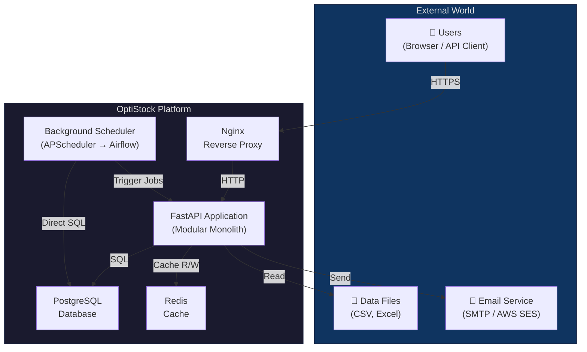
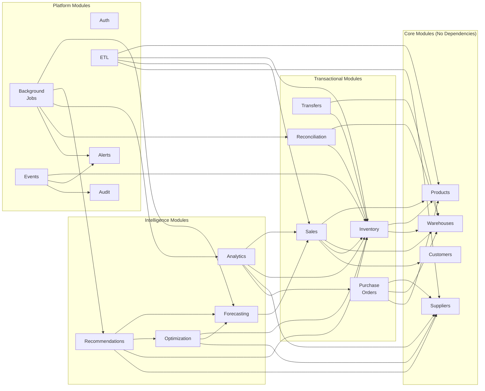

# OptiStock — System Architecture Document

> **OptiStock — Enterprise Inventory Intelligence Platform**

**Document Version:** 1.0  
**Date:** 2026-07-01  
**Author:** OptiStock Engineering Team  
**Status:** Draft — Pending Technical Review  
**Reference:** [SRS v1.1](./02_software_requirement_specification.md)

---

## 1. Architecture Philosophy

### 1.1 Guiding Principles

| Principle | What It Means in Practice |
|---|---|
| **Modular Monolith** | One deployable application, but internally organized as independent modules with clear boundaries |
| **Complexity Only When Justified** | No technology is added until the problem it solves is felt. Redis is not added until dashboard queries are slow. Airflow is not added until manual cron becomes unmanageable. |
| **Clean Architecture** | Business logic never depends on frameworks, databases, or external services. Frameworks serve the business logic, not the other way around. |
| **Database as Source of Truth** | PostgreSQL is the single source of truth. All constraints, validations, and relationships are enforced at the database level — not just in application code. |
| **API-First** | The backend is frontend-agnostic. Any client (React, Power BI, mobile app, CLI) can consume the same APIs. |
| **Observable by Default** | Every request has a trace ID. Every business action is logged. Every background job reports its status. |

### 1.2 Why Not Microservices?

| Consideration | Microservices | Modular Monolith (Our Choice) |
|---|---|---|
| **Team size** | 10+ engineers per service | 1 developer — manageable |
| **Deployment** | Deploy 8+ services independently | Deploy 1 application |
| **Communication** | HTTP/gRPC between services (slow, can fail) | Function calls (fast, reliable) |
| **Debugging** | Distributed tracing required | Stack traces work normally |
| **Data consistency** | Eventual consistency, saga patterns | Database transactions |
| **Infrastructure** | Service discovery, API gateway, message broker | One process, one database |
| **Extractability** | Already separate services | Module boundaries make future extraction easy |

**When would we switch?** Only if the team grows to 5+ engineers working on different modules simultaneously, or if a specific module needs independent scaling (e.g., ML inference handling 100x the load of CRUD APIs). Neither applies to this project.

---

## 2. High-Level System Architecture

### 2.1 System Context Diagram

This shows OptiStock and everything external to it.



### 2.2 Component Architecture

This shows the internal structure of the FastAPI application.

```mermaid
graph TB
    subgraph API["API Layer (FastAPI Routers)"]
        R_AUTH["Auth Router<br/>/api/v1/auth/*"]
        R_PROD["Product Router<br/>/api/v1/products/*"]
        R_INV["Inventory Router<br/>/api/v1/inventory/*"]
        R_WH["Warehouse Router<br/>/api/v1/warehouses/*"]
        R_SUP["Supplier Router<br/>/api/v1/suppliers/*"]
        R_PO["PO Router<br/>/api/v1/purchase-orders/*"]
        R_SALE["Sales Router<br/>/api/v1/sales/*"]
        R_CUST["Customer Router<br/>/api/v1/customers/*"]
        R_ANLY["Analytics Router<br/>/api/v1/analytics/*"]
        R_ETL["Import/Export Router<br/>/api/v1/import/*"]
        R_FC["Forecast Router<br/>/api/v1/forecasts/*"]
        R_REC["Recommendation Router<br/>/api/v1/recommendations/*"]
        R_ALT["Alert Router<br/>/api/v1/alerts/*"]
        R_RECON["Reconciliation Router<br/>/api/v1/reconciliation/*"]
        R_ADM["Admin Router<br/>/api/v1/admin/*"]
    end

    subgraph MW["Middleware Layer"]
        M_AUTH["Auth Middleware<br/>(JWT Validation)"]
        M_LOG["Logging Middleware<br/>(Request/Response)"]
        M_ERR["Error Handler<br/>(Consistent Errors)"]
        M_CORS["CORS Middleware"]
        M_REQ["Request ID<br/>Middleware"]
    end

    subgraph SVC["Service Layer (Business Logic)"]
        S_AUTH["Auth Service"]
        S_PROD["Product Service"]
        S_INV["Inventory Service"]
        S_WH["Warehouse Service"]
        S_SUP["Supplier Service"]
        S_PO["PO Service"]
        S_SALE["Sales Service"]
        S_CUST["Customer Service"]
        S_ANLY["Analytics Service"]
        S_ETL["ETL Service"]
        S_FC["Forecast Service"]
        S_REC["Recommendation Service"]
        S_ALT["Alert Service"]
        S_RECON["Reconciliation Service"]
        S_EVT["Event Service"]
    end

    subgraph REPO["Repository Layer (Data Access)"]
        RP_PROD["Product Repo"]
        RP_INV["Inventory Repo"]
        RP_WH["Warehouse Repo"]
        RP_SUP["Supplier Repo"]
        RP_PO["PO Repo"]
        RP_SALE["Sales Repo"]
        RP_CUST["Customer Repo"]
        RP_FC["Forecast Repo"]
        RP_REC["Recommendation Repo"]
        RP_ALT["Alert Repo"]
        RP_RECON["Reconciliation Repo"]
        RP_AUDIT["Audit Repo"]
        RP_MOVE["Movement Repo"]
    end

    subgraph DATA["Data Layer"]
        PG["PostgreSQL"]
        RD["Redis Cache"]
    end

    API --> MW --> SVC --> REPO --> DATA
```



---

## 3. Layered Architecture — The Four Layers

This is the most important architectural decision in the project. Every module follows the same four-layer structure.

### 3.1 Why Layers?

Imagine you're building the Sales module. Without layers:

```python
# ❌ BAD: Everything in one function
@router.post("/sales")
def create_sale(sale_data):
    # Validation mixed with business logic mixed with database queries
    conn = get_db()
    product = conn.execute("SELECT * FROM products WHERE id = ?", sale_data.product_id)
    if product.quantity < sale_data.quantity:
        raise Exception("Not enough stock")
    conn.execute("INSERT INTO sales ...")
    conn.execute("UPDATE inventory SET quantity = quantity - ?", sale_data.quantity)
    if new_quantity <= product.min_stock:
        conn.execute("INSERT INTO alerts ...")
    conn.commit()
    return {"status": "ok"}
```

This is unmaintainable. The route handler is doing validation, business logic, database queries, and side effects all in one place. If you want to change the database, you change every endpoint. If you want to add a new side effect, you modify the same function.

With layers:

```python
# ✅ GOOD: Each layer has one responsibility

# Layer 1: Router — HTTP concerns only
@router.post("/sales", response_model=SaleResponse, status_code=201)
def create_sale(sale_data: SaleCreate, current_user: User = Depends(get_current_user)):
    return sale_service.create_sale(sale_data, current_user)

# Layer 2: Service — Business logic only
class SaleService:
    def create_sale(self, sale_data, user):
        product = self.product_repo.get_by_id(sale_data.product_id)
        inventory = self.inventory_repo.get_available(sale_data.product_id, sale_data.warehouse_id)
        if inventory.available_quantity < sale_data.quantity:
            raise InsufficientStockError(...)
        sale = self.sale_repo.create(sale_data)
        self.event_service.emit(SaleCreatedEvent(sale))
        return sale

# Layer 3: Repository — Database access only
class SaleRepository:
    def create(self, sale_data):
        return self.db.add(SaleModel(**sale_data.dict()))

# Layer 4: Models/Schemas — Data shapes only
class SaleCreate(BaseModel):
    product_id: int
    warehouse_id: int
    quantity: int
    unit_price: Decimal
```

### 3.2 The Four Layers

```
┌─────────────────────────────────────────────────────────────────┐
│                     Layer 1: API / Router Layer                  │
│                                                                  │
│  Responsibility:                                                 │
│  • HTTP request/response handling                                │
│  • Request validation (via Pydantic schemas)                     │
│  • Authentication check (via dependency injection)               │
│  • Response serialization                                        │
│  • HTTP status codes                                             │
│                                                                  │
│  Does NOT contain business logic.                                │
│  Calls the Service layer and returns its result.                 │
├─────────────────────────────────────────────────────────────────┤
│                     Layer 2: Service Layer                        │
│                                                                  │
│  Responsibility:                                                 │
│  • Business rules and validation                                 │
│  • Orchestration (coordinate multiple repositories)              │
│  • Event emission (trigger side effects)                         │
│  • Transaction management                                        │
│  • Business calculations (EOQ, ROP, scoring)                     │
│                                                                  │
│  Does NOT know about HTTP, JSON, or request/response formats.    │
│  Calls the Repository layer for data access.                     │
├─────────────────────────────────────────────────────────────────┤
│                     Layer 3: Repository Layer                    │
│                                                                  │
│  Responsibility:                                                 │
│  • Database queries (CRUD operations)                            │
│  • Query construction                                            │
│  • Data filtering and pagination                                 │
│  • Raw SQL or ORM operations                                     │
│                                                                  │
│  Does NOT contain business logic.                                │
│  Returns domain models, not raw database rows.                   │
├─────────────────────────────────────────────────────────────────┤
│                     Layer 4: Models / Schemas                    │
│                                                                  │
│  Responsibility:                                                 │
│  • Database models (SQLAlchemy ORM models)                       │
│  • API schemas (Pydantic models for request/response)            │
│  • Domain objects                                                │
│  • Enums and constants                                           │
│                                                                  │
│  Pure data definitions. No logic.                                │
└─────────────────────────────────────────────────────────────────┘
```

### 3.3 Dependency Rule

**Dependencies only flow downward.** This is the most important rule:

```
Router → Service → Repository → Database
  ↓         ↓          ↓
Schema   Schema     Model
```

- Routers depend on Services — never the reverse
- Services depend on Repositories — never the reverse
- Repositories depend on Models — never the reverse
- **No layer skipping** — a Router must never call a Repository directly

This rule ensures that you can change the database without touching business logic, change the API format without touching database queries, and test business logic without starting a web server.

---

## 4. Module Architecture

### 4.1 Module Structure

Every module in OptiStock follows the same internal structure:

```
app/
└── modules/
    └── {module_name}/
        ├── __init__.py
        ├── router.py          # API endpoints (Layer 1)
        ├── service.py         # Business logic (Layer 2)
        ├── repository.py      # Database queries (Layer 3)
        ├── models.py          # SQLAlchemy ORM models (Layer 4)
        ├── schemas.py         # Pydantic request/response schemas (Layer 4)
        ├── exceptions.py      # Module-specific exceptions
        ├── constants.py       # Module-specific enums, constants
        └── dependencies.py    # FastAPI dependency injection
```

### 4.2 Module Dependency Map

Not all modules are independent. Some modules depend on others. This map shows allowed dependencies:



**Key insight:** Notice how the Intelligence modules (Analytics, Forecasting, Optimization, Recommendations) sit on top. They consume data from Transactional modules but never write back to them directly. This is intentional — the AI layer advises, the human acts through the transactional layer.

---

## 5. Data Architecture

### 5.1 Database Architecture

```
┌──────────────────────────────────────────────────────────────┐
│                    PostgreSQL Database                         │
│                                                               │
│  ┌─────────────────────────────────────────────────────────┐  │
│  │              Core Tables (Stage 1)                       │  │
│  │  products │ warehouses │ suppliers │ customers            │  │
│  └─────────────────────────────────────────────────────────┘  │
│                                                               │
│  ┌─────────────────────────────────────────────────────────┐  │
│  │          Transactional Tables (Stage 1)                  │  │
│  │  inventory │ inventory_movements │ sales                  │  │
│  │  purchase_orders │ purchase_order_items                   │  │
│  │  transfers                                                │  │
│  └─────────────────────────────────────────────────────────┘  │
│                                                               │
│  ┌─────────────────────────────────────────────────────────┐  │
│  │           Platform Tables (Stage 2–3)                    │  │
│  │  users │ refresh_tokens │ audit_logs │ alerts             │  │
│  └─────────────────────────────────────────────────────────┘  │
│                                                               │
│  ┌─────────────────────────────────────────────────────────┐  │
│  │        Intelligence Tables (Stage 4–8)                   │  │
│  │  forecasts │ forecast_accuracy │ recommendations          │  │
│  │  reconciliation_sessions │ reconciliation_counts          │  │
│  │  product_classifications │ supplier_scores                │  │
│  └─────────────────────────────────────────────────────────┘  │
│                                                               │
│  ┌─────────────────────────────────────────────────────────┐  │
│  │            System Tables (Stage 3+)                      │  │
│  │  job_executions │ system_config │ import_sessions          │  │
│  └─────────────────────────────────────────────────────────┘  │
│                                                               │
└──────────────────────────────────────────────────────────────┘
```

### 5.2 Data Tiering & Archival Strategy

We implement data tiering via **PostgreSQL Table Partitioning** rather than moving data to separate databases or storage systems. This keeps the architecture simple while maintaining high performance at scale.

| Tier | Characteristics | Implementation |
|---|---|---|
| **Hot** | Current operational data (last 90 days). Frequently queried, updated. | Recent partitions. Kept in memory/cache. Queries use `sale_date >= NOW() - INTERVAL '90 days'` to leverage partition pruning. |
| **Warm** | Historical data (90 days to 2 years). Used for reporting, forecasting. | Older partitions residing on disk. Seamlessly queryable through the parent table. |
| **Cold / Archive** | Legacy data (> 2 years). Rarely accessed. | Partitions are detached from the parent table. Can be moved to slower storage or dumped to S3, but remain restorable. |

**Why not a separate Archive Database?**
Moving data between databases requires ETL jobs, introduces eventual consistency issues, and breaks historical reporting queries. Partitioning gives us the performance of small tables with the convenience of a single queryable entity.

### 5.3 Caching Strategy (Stage 9+)

Redis is introduced only when we have evidence that database queries are a bottleneck.

```
┌──────────────────────────────────────────────────────────────┐
│                      Cache Strategy                           │
│                                                               │
│  Cache Level 1: API Response Cache                            │
│  ┌──────────────────────────────────────────────────────┐     │
│  │  Key: "dashboard:executive:{user_id}"                │     │
│  │  TTL: 60 seconds                                     │     │
│  │  Invalidation: On any sale, inventory change          │     │
│  │                                                       │     │
│  │  Key: "analytics:abc_classification"                  │     │
│  │  TTL: 24 hours (recalculated weekly)                  │     │
│  │  Invalidation: On ABC reclassification job            │     │
│  │                                                       │     │
│  │  Key: "warehouse:utilization:{warehouse_id}"          │     │
│  │  TTL: 5 minutes                                       │     │
│  │  Invalidation: On inventory change in that warehouse  │     │
│  └──────────────────────────────────────────────────────┘     │
│                                                               │
│  Cache Level 2: Computed Value Cache                          │
│  ┌──────────────────────────────────────────────────────┐     │
│  │  Key: "supplier_score:{supplier_id}"                  │     │
│  │  TTL: 24 hours                                        │     │
│  │  Invalidation: On supplier score recalculation        │     │
│  │                                                       │     │
│  │  Key: "product:eoq:{product_id}"                      │     │
│  │  TTL: 24 hours                                        │     │
│  │  Invalidation: On new sales data or forecast update   │     │
│  └──────────────────────────────────────────────────────┘     │
│                                                               │
│  NOT Cached (Always Fresh):                                   │
│  • Inventory quantities (must be real-time)                   │
│  • Authentication/authorization checks                        │
│  • Audit logs                                                 │
│  • Active alerts                                              │
│                                                               │
└──────────────────────────────────────────────────────────────┘
```

**Why inventory quantities are never cached:** If someone checks stock and sees "250 units," but the cached value is stale and the real quantity is 50, they might commit to selling 200 units. Inventory must always be queried from the database. This is a non-negotiable rule in inventory systems.

---

## 6. Event System Architecture

### 6.1 Internal Event Bus (In-Process)

OptiStock uses a simple in-process event system to decouple modules. This is **not** Kafka or RabbitMQ — it's a Python function call dispatcher inside the monolith.

```
┌──────────────────────────────────────────────────────────────┐
│                   Event Flow Example                          │
│                                                               │
│  Sale Service                                                 │
│       │                                                       │
│       ├── 1. Validate sale data                               │
│       ├── 2. Create sale record in DB                         │
│       ├── 3. Emit event: SaleCreatedEvent                     │
│       │       │                                               │
│       │       ▼                                               │
│       │   Event Dispatcher                                    │
│       │       │                                               │
│       │       ├── Handler 1: InventoryAdjustmentHandler       │
│       │       │       └── Decrement stock                     │
│       │       │                                               │
│       │       ├── Handler 2: AlertCheckHandler                │
│       │       │       └── Check low stock, create alert       │
│       │       │                                               │
│       │       ├── Handler 3: AuditLogHandler                  │
│       │       │       └── Log 'sale.created'                  │
│       │       │                                               │
│       │       └── Handler 4: CustomerUpdateHandler            │
│       │               └── Update lifetime value               │
│       │                                                       │
│       └── 4. Return sale to caller                            │
│                                                               │
└──────────────────────────────────────────────────────────────┘
```

### 6.2 Why Not Kafka?

| Factor | Kafka | In-Process Events (Our Choice) |
|---|---|---|
| **Data volume** | Millions of events/second | Hundreds of events/day |
| **Failure isolation** | If handler fails, event is requeued | If handler fails, wrap in try/catch, log error, continue |
| **Ordering** | Guaranteed per partition | Guaranteed (synchronous) |
| **Infrastructure** | Separate cluster, ZooKeeper | Zero infrastructure |
| **When to switch** | When events need to cross service boundaries or survive process restarts | Not applicable for our scale |

### 6.3 Event Definitions

| Event | Emitted By | Consumed By | Stage |
|---|---|---|---|
| `SaleCreatedEvent` | Sales Service | Inventory, Alerts, Audit, Customer | 1 |
| `InventoryAdjustedEvent` | Inventory Service | Alerts, Warehouse | 1 |
| `PODeliveredEvent` | PO Service | Inventory, Supplier, Warehouse, Alerts, Audit | 1 |
| `POOverdueEvent` | Background Job | Alerts, Audit | 3 |
| `TransferCompletedEvent` | Transfer Service | Inventory (×2), Alerts, Audit | 3 |
| `LowStockEvent` | Inventory Service | Alerts, Recommendation Queue | 3 |
| `ExpiryDetectedEvent` | Background Job | Alerts, Audit | 3 |
| `ReconciliationApprovedEvent` | Reconciliation Service | Inventory, Alerts, Analytics, Audit | 4 |
| `SupplierScoreUpdatedEvent` | Background Job | Alerts (if score dropped), Audit | 7 |
| `ForecastGeneratedEvent` | Background Job | Recommendation Queue | 7 |
| `RecommendationAcceptedEvent` | Recommendation Service | PO/Transfer/Supplier (pre-fill), Audit | 8 |

---

## 7. Background Job Architecture

### 7.1 Job Scheduling Evolution

```
Stage 3–5: Simple Scheduling
┌──────────────────────────────────────────┐
│         APScheduler (In-Process)          │
│                                           │
│  ┌─────────────┐  ┌─────────────┐        │
│  │ Expiry Scan  │  │ PO Overdue  │  ...   │
│  │ Daily 7AM    │  │ Daily 8AM   │        │
│  └──────┬──────┘  └──────┬──────┘        │
│         │                │                │
│         ▼                ▼                │
│    Python Functions (same process)        │
│         │                │                │
│         ▼                ▼                │
│       PostgreSQL                          │
└──────────────────────────────────────────┘

Stage 6+: Orchestrated Scheduling
┌──────────────────────────────────────────┐
│            Apache Airflow                 │
│                                           │
│  ┌───────────────────────────────────┐    │
│  │  DAG: nightly_intelligence        │    │
│  │                                    │    │
│  │  01:00 ──→ ABC Classification      │    │
│  │             │                      │    │
│  │  01:30 ──→ Dead Stock Detection    │    │
│  │             │                      │    │
│  │  02:00 ──→ Recommendation Engine ──┤    │
│  │             │                 │    │    │
│  │  03:00 ──→ Forecast Refresh  │    │    │
│  │             │                 │    │    │
│  │  04:00 ──→ Supplier Scores   │    │    │
│  │             │                 │    │    │
│  │  05:00 ──→ Cleanup Jobs      │    │    │
│  └───────────────────────────────────┘    │
│                                           │
│  ┌───────────────────────────────────┐    │
│  │  DAG: daily_operations            │    │
│  │                                    │    │
│  │  06:00 ──→ Cycle Count Scheduler   │    │
│  │  07:00 ──→ Expiry Scanner          │    │
│  │  08:00 ──→ Overdue PO Scanner      │    │
│  └───────────────────────────────────┘    │
│                                           │
└──────────────────────────────────────────┘
```

### 7.2 Job Execution State Machine

Every background job follows this lifecycle:

```
SCHEDULED → RUNNING → COMPLETED
                ↓
            FAILED → RETRYING → RUNNING
                         ↓
                     FAILED (final) → ALERT
```

---

## 8. ML Model Lifecycle Management

**Business Context:** Machine learning models are not static code; they degrade over time as real-world behavior changes (concept drift). An enterprise system must treat models as living assets that require monitoring, retraining, and versioning.

### 8.1 Model Training Strategy

Historical data is not treated uniformly. Training on outdated patterns degrades forecast accuracy.

| Component | Strategy |
|---|---|
| **Sliding Window** | Models are trained only on a configurable rolling window (e.g., last 24 months). Older data is ignored for training purposes. |
| **Feature Engineering** | Automatic extraction of temporal features (day of week, month, holiday proximity) to capture seasonality. |
| **Retraining Schedule** | Configurable via Admin panel (e.g., weekly or monthly) using the background job scheduler (Stage 7+). |

### 8.2 Model Versioning & Evaluation

Every time a model is retrained, it follows a strict lifecycle before being promoted to production:

1. **Train:** New model is trained on the sliding window.
2. **Backtest:** Evaluated on the most recent 30 days of data (holdout set).
3. **Compare:** Calculate MAPE (Mean Absolute Percentage Error).
4. **Promote or Discard:**
   - If `new_MAPE < current_MAPE` (and below the configured threshold, e.g., 20%), promote to `active`.
   - If worse, discard and log a warning. The `active` model remains in production.
5. **Rollback:** Administrators can manually revert to a previous model version if unexpected behavior occurs.

### 8.3 Concept Drift Monitoring

The Forecast Accuracy Tracking job (FR-FC-002) acts as our drift monitor. If the `active` model's MAPE exceeds the configured acceptable threshold (e.g., 25%) for three consecutive periods, the system generates an alert signaling that human intervention or immediate retraining is required.

---

## 9. Security Architecture

### 9.1 Authentication Flow

```
┌──────────┐                    ┌──────────┐                    ┌──────────┐
│  Client   │                    │  FastAPI  │                    │ Database │
└─────┬────┘                    └─────┬────┘                    └─────┬────┘
      │                               │                               │
      │  POST /auth/login              │                               │
      │  {email, password}             │                               │
      │──────────────────────────────→│                               │
      │                               │  SELECT user WHERE email=?     │
      │                               │──────────────────────────────→│
      │                               │                               │
      │                               │  user record                   │
      │                               │←──────────────────────────────│
      │                               │                               │
      │                               │  Verify bcrypt(password, hash) │
      │                               │                               │
      │  {access_token, refresh_token} │                               │
      │←──────────────────────────────│                               │
      │                               │                               │
      │  GET /api/v1/products          │                               │
      │  Authorization: Bearer {JWT}   │                               │
      │──────────────────────────────→│                               │
      │                               │                               │
      │                               │  Decode JWT (no DB call)       │
      │                               │  Check role permissions        │
      │                               │                               │
      │                               │  SELECT products...            │
      │                               │──────────────────────────────→│
      │                               │                               │
      │  {products: [...]}             │                               │
      │←──────────────────────────────│                               │
```

**Key point:** JWT validation is stateless — no database call needed. The token contains the user's role, so permission checks happen in-memory. This is why FR-AU-004 specifies the JWT payload must include `role`.

### 8.2 Authorization Flow

```
Request arrives
    │
    ▼
Middleware: Extract JWT from Authorization header
    │
    ├── No token? → 401 Unauthorized
    ├── Invalid/expired token? → 401 Unauthorized
    │
    ▼
Middleware: Decode JWT → extract user_id, role
    │
    ▼
Route Handler: Check role against RBAC matrix (FR-AU-005)
    │
    ├── Role not permitted? → 403 Forbidden
    │
    ▼
Service Layer: Execute business logic
    │
    ▼
Return response
```

---

## 10. Deployment Architecture

### 10.1 Development (Stages 1–4)

```
┌─────────────────────────────────────────────────────┐
│                  Developer Laptop                    │
│                                                      │
│   ┌──────────────┐    ┌──────────────────────────┐  │
│   │   FastAPI     │    │    PostgreSQL             │  │
│   │   (uvicorn)   │───→│    (localhost:5432)       │  │
│   │   port 8000   │    │                           │  │
│   └──────────────┘    └──────────────────────────┘  │
│                                                      │
│   Run: uvicorn app.main:app --reload                 │
│                                                      │
└─────────────────────────────────────────────────────┘
```

No Docker. No Nginx. No Redis. Just FastAPI and PostgreSQL on your machine.

### 9.2 Dockerized (Stages 5–9)

```
┌─────────────────────────────────────────────────────┐
│                  Docker Compose                      │
│                                                      │
│   ┌──────────────┐    ┌──────────────────────────┐  │
│   │   Nginx       │    │    FastAPI (Backend)      │  │
│   │   port 80/443 │───→│    port 8000              │  │
│   └──────────────┘    └───────────┬──────────────┘  │
│                                    │                 │
│                        ┌───────────┼──────────┐      │
│                        │           │          │      │
│                        ▼           ▼          ▼      │
│               ┌──────────┐ ┌──────────┐ ┌─────────┐ │
│               │PostgreSQL│ │  Redis   │ │ Airflow │  │
│               │port 5432 │ │port 6379 │ │port 8080│  │
│               └──────────┘ └──────────┘ └─────────┘  │
│                                                      │
│   Run: docker compose up                             │
│                                                      │
└─────────────────────────────────────────────────────┘
```

### 9.3 Production (Stages 10–11)

```
┌─────────────────────────────────────────────────────┐
│                      AWS Cloud                       │
│                                                      │
│   ┌────────────────────────────────────────────────┐ │
│   │  EC2 Instance                                   │ │
│   │  ┌──────────┐    ┌──────────────────────────┐  │ │
│   │  │  Nginx    │───→│  FastAPI (Docker)         │  │ │
│   │  │  HTTPS    │    │  + Airflow (Docker)       │  │ │
│   │  └──────────┘    └───────────┬──────────────┘  │ │
│   └────────────────────────────────────────────────┘ │
│                                    │                  │
│              ┌─────────────────────┼───────────┐      │
│              │                     │           │      │
│              ▼                     ▼           ▼      │
│   ┌──────────────────┐  ┌──────────────┐ ┌────────┐  │
│   │  AWS RDS          │  │ ElastiCache  │ │  S3    │  │
│   │  PostgreSQL       │  │ (Redis)      │ │Backups │  │
│   │  Multi-AZ         │  │              │ │& Files │  │
│   └──────────────────┘  └──────────────┘ └────────┘  │
│                                                      │
│   ┌──────────────────┐                                │
│   │  CloudWatch       │  Monitoring & Alerts          │
│   └──────────────────┘                                │
│                                                      │
└─────────────────────────────────────────────────────┘
```

---

## 10. Architecture Evolution by Stage

This is the most practical section. It tells you exactly what infrastructure exists at each stage.

| Stage | Components | What's New | What's NOT Present |
|---|---|---|---|
| **1** | FastAPI + PostgreSQL | Core backend, CRUD APIs | No Docker, No Redis, No Auth, No Nginx |
| **2** | + JWT Auth | Authentication, RBAC | No Docker, No Redis, No Nginx |
| **3** | + Alerts, Audit | Event system, health check, basic background jobs | No Docker, No Redis, No Nginx |
| **4** | + Analytics, Reconciliation | Dashboard APIs, KPIs, reconciliation | No Docker, No Redis, No Nginx |
| **5** | + ETL Import/Export | File upload, validation pipeline | No Redis, No Nginx |
| **6** | + Airflow | Scheduled pipelines, orchestration | No Redis, No Nginx |
| **7** | + ML Models | Forecasting, supplier scoring | No Redis, No Nginx |
| **8** | + Recommendation Engine | AI Decision Support, explainability | No Redis, No Nginx |
| **9** | + Redis, Performance | Caching, pagination optimization, connection pooling | No Nginx in dev |
| **10** | + Docker, Nginx, AWS | Full deployment pipeline | — |
| **11** | + Logging, Monitoring | Structured logs, health checks, rate limiting | — |
| **12** | + AI Assistant | Natural language query interface | — |

**Critical rule:** At every stage, the application must be fully functional. Stage 3 is not "broken Stage 8." Stage 3 is a complete, working inventory management system with auth, alerts, and audit logging.

---

## 12. Technology Decisions and Justifications

| Technology | Problem It Solves | When Introduced | Alternatives Considered |
|---|---|---|---|
| **Python** | General-purpose language for backend, ML, and data engineering | Stage 1 | Go (no ML ecosystem), Java (verbose for solo dev), Node.js (weak data/ML support) |
| **FastAPI** | High-performance async API framework with auto-docs | Stage 1 | Flask (no async, no auto-docs), Django (too opinionated, ORM lock-in), Express.js (no type safety) |
| **PostgreSQL** | Enterprise-grade RDBMS with advanced features (CTEs, window functions, JSON, partitioning) | Stage 1 | MySQL (fewer analytics features), MongoDB (no ACID for inventory), SQLite (no concurrency) |
| **SQLAlchemy** | Python ORM with support for raw SQL when needed | Stage 1 | Django ORM (tied to Django), raw SQL only (tedious for CRUD), Tortoise ORM (less mature) |
| **Alembic** | Database migration versioning | Stage 1 | Django migrations (tied to Django), manual SQL files (error-prone, no rollback tracking) |
| **Pydantic** | Request/response validation and serialization | Stage 1 | Marshmallow (slower, more verbose), manual validation (unsafe) |
| **JWT** | Stateless authentication | Stage 2 | Session cookies (requires server-side storage), OAuth2 only (complex for internal APIs) |
| **APScheduler** | Lightweight job scheduling within the application | Stage 3 | Celery (requires Redis/RabbitMQ broker — premature), cron (no retry, no logging) |
| **Apache Airflow** | DAG-based workflow orchestration with monitoring UI | Stage 6 | Prefect (less mature), Luigi (less active), Dagster (newer, smaller community) |
| **Redis** | In-memory caching for frequently-read, slowly-changing data | Stage 9 | Memcached (no data structures), application-level caching (lost on restart) |
| **Docker** | Consistent deployment across environments | Stage 10 | Virtual machines (heavy), bare metal (inconsistent), Kubernetes (massive overkill for this project) |
| **Nginx** | Reverse proxy, HTTPS termination, static files | Stage 10 | Traefik (more complex config), Caddy (less battle-tested in enterprise) |
| **scikit-learn / XGBoost / Prophet** | Demand forecasting ML models | Stage 7 | TensorFlow (overkill for tabular data), PyTorch (overkill), statsmodels (limited model selection) |

---

## 13. Cross-Cutting Concerns

### 13.1 Request Lifecycle

Every API request follows this exact path:

```
Client Request
    │
    ▼
1. Nginx (HTTPS termination, rate limiting) ←── Stage 10+
    │
    ▼
2. FastAPI Middleware Stack:
    ├── Request ID Middleware → generate UUID, attach to request
    ├── Logging Middleware → log request method, path, user
    ├── CORS Middleware → validate origin
    ├── Auth Middleware → validate JWT, extract user
    └── Error Handler → catch exceptions, return consistent format
    │
    ▼
3. Router → validate request body (Pydantic)
    │
    ▼
4. Service → execute business logic, emit events
    │
    ▼
5. Repository → query database
    │
    ▼
6. Response → serialize via Pydantic, return JSON
    │
    ▼
7. Logging Middleware → log response status, duration
    │
    ▼
Client Response
```

### 13.2 Error Propagation

```
Repository Layer
    │ raises: SQLAlchemy exceptions, IntegrityError
    │
    ▼ (caught and translated by)
Service Layer
    │ raises: Business exceptions (InsufficientStockError, DuplicateSKUError)
    │
    ▼ (caught and translated by)
Error Handler Middleware
    │ maps to: HTTP status codes + consistent JSON error format
    │
    ▼
Client receives:
{
    "error": {
        "code": "INSUFFICIENT_STOCK",
        "message": "Cannot sell 500 units. Only 250 available.",
        "request_id": "abc-123"
    }
}
```

### 13.3 Logging Strategy

```
Structured JSON Log Entry:
{
    "timestamp": "2026-07-01T10:00:00Z",
    "level": "INFO",
    "request_id": "abc-123",
    "user_id": "user_456",
    "module": "sales",
    "action": "create_sale",
    "message": "Sale created successfully",
    "context": {
        "sale_id": "sale_789",
        "product_id": "prod_123",
        "quantity": 50,
        "revenue": 2500.00,
        "warehouse_id": "wh_001"
    },
    "duration_ms": 45
}
```

---

## Document Approval

| Role | Name | Date | Status |
|---|---|---|---|
| Project Owner | — | — | Pending |
| Technical Lead | — | — | Pending |

---

*This document will be updated as the architecture evolves. All changes will be tracked with version numbers and dates.*
